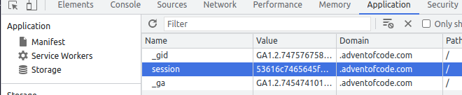

# Advent of Code 2022
What is the [advent of code](https://adventofcode.com/2022/about)?

Basically it is an advent calendar for programming puzzles put on every year with a different theme. If interested checkout the submarine problems of [2021](https://adventofcode.com/2021).

Each year the objective is to solve the problems as they come out (midnight EST). Last year I used python to solve some of the problems, this year I will be learning how to use [rust](https://www.rust-lang.org/). There is a [crate](https://github.com/gobanos/cargo-aoc) to assist with some of the basic setup required for each problem.

For the crate you will need to set the `session-id`. It can be found as a cookie on the aoc website if you are logged in:


## Installation
```
cargo install cargo-aoc
cargo aoc credentials -s {token}

# Create a package for the day
cargo new <package_name>
cargo add aoc-runner aoc-runner-derive
```

## Using the aoc-crate
First thing we want to download the input
```
# If no additional arguments are provided it will default to the current date
cargo aoc input -d {day} -y {year}
```

To test the solution for a given day run
```
cargo aoc
```